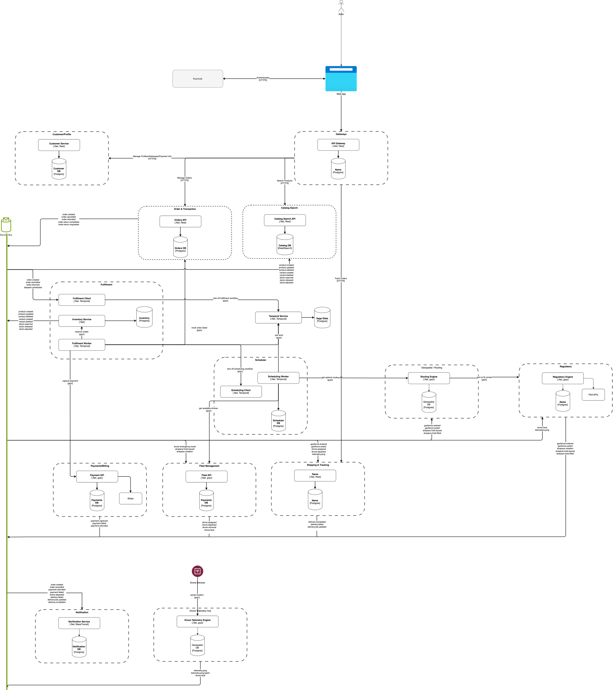

# Checkout: Autonomous Logistics & Drone Orchestration Platform

### 🚀 Overview
**Checkout** is an enterprise-grade distributed system designed to handle high-velocity commerce and autonomous fulfillment. While the name is simple, the engine is a complex **global logistics orchestrator** that manages real-time drone telemetry, multi-region inventory, and automated delivery lifecycles.

This project demonstrates **Principal-level software engineering** by tackling the "hard" problems of distributed systems: real-time data at scale, eventual consistency, and self-healing infrastructure.

---
### Architecture Diagram


### 🏗️ Architectural Bounded Contexts - Services Reference
The system is partitioned into specialized microservices using **Domain-Driven Design (DDD)** and an **Event-Driven Architecture (EDA)**:

| Service | Primary responsibility | Key patterns / tech | Runtime | External comms | Internal comms | Independently deployed | Status |
|---|---|---|---|---|---|---|---|
| **API Gateway (YARP)** | TLS termination, JWT validation at the edge, rate limiting, routing to downstream services | YARP | .NET | REST (public) | Routes to downstream | ✅ Yes | ✅ Defined |
| **Keycloak** | Authentication, JWT issuance, token revocation, RBAC, secret management, audit event emission | OpenIddict, OIDC, OAuth2, Redis blocklist, Vault | .NET | REST / OIDC | REST (JWKS, introspection) | ✅ Yes | ✅ Defined |
| **Order & Transaction** | Hot-path checkout: accept orders, process payments, initiate the fulfillment saga, implement transactional outbox | MassTransit, Outbox Pattern, Polly | .NET | REST (via gateway) | Publishes events | ✅ Yes | ✅ Defined |
| **Fulfillment Orchestrator** | Durable fulfillment workflow: consumes `order.created` to start a Temporal Workflow; Activities call downstream services via gRPC; MassTransit consumer bridges bus events to Temporal signals | Temporal Workflow, Temporal .NET SDK, MassTransit (consumer only) | .NET | None | Consumes `order.created` via MassTransit → starts Temporal Workflow; consumes `drone.assigned` via MassTransit → signals Temporal to resume; Activities call downstream via gRPC | ✅ Yes | ✅ Defined |
| **Inventory Service** | Track stock levels per warehouse, handle reservation and release during fulfillment workflow, prevent oversell across concurrent orders | EF Core, optimistic concurrency | .NET | None | gRPC (called by Temporal Activities) | ✅ Yes | ❌ Missing |
| **Payment / Billing** | Wrap 3rd-party payment gateway, own charge/hold/capture/refund lifecycle, expose a clean internal API to the fulfillment workflow | Polly (circuit breaker), idempotency keys | .NET | None | gRPC (called by Temporal Activities); publishes `payment.failed` on compensation | ✅ Yes | ❌ Missing |
| **Customer / Profile** | Store delivery addresses, contact preferences, notification channels, and account history | EF Core, read/write split | .NET | REST (via gateway) | REST | ✅ Yes | ❌ Missing |
| **Drone Telemetry Hub** | High-throughput ingestion of real-time GPS pings from thousands of active drones; buffer to Redis; fan out to subscribers | SignalR, Redis, WebSockets | Go | WebSocket (drones) | Publishes to Redis / MassTransit | ✅ Yes | ✅ Defined |
| **Fleet Management** | Own the drone registry: hardware IDs, battery state, maintenance status, home dock, and availability for assignment | EF Core, scheduled jobs | .NET | None | gRPC / REST | ✅ Yes | ❌ Missing |
| **Shipping & Tracking** | Source of truth for shipment state; bridge telemetry to order; compute real-time ETAs; react to geofence boundary events | Redis, time-series reads | .NET | REST (via gateway) | Consumes `telemetry.ping`, `geofence.entered`, `geofence.exited`; publishes delivery and ETA events | ✅ Yes | ✅ Defined |
| **Geospatial / Routing** | Compute optimal drone flight paths, integrate with maps API, reroute around dynamic obstacles; maintains a real-time drone position cache (Redis) derived from the telemetry stream; reroutes in-flight drones on airspace violations and holds | H3 / S2, Maps API, Polly | Go | None | Consumes `airspace.violation`, `airspace.hold.issued`; gRPC (flight path + routing queries); publishes rerouting instructions or triggers `drone.emergency.recall` if no safe route exists | ✅ Yes | ❌ Missing |
| **Regulatory / Airspace** | Enforce FAA and local authority rules: own airspace boundary definitions, evaluate drone positions against boundaries, publish geofence crossing events, weather holds, emergency recall | External authority APIs, event triggers | Go | None | Consumes `telemetry.ping`; publishes `geofence.entered`, `geofence.exited`, `airspace.violation`, `drone.emergency.recall` | ✅ Yes | ❌ Missing |
| **Scheduler / Optimizer** | Select and lock available drones via Fleet Management, determine dispatch timing, batch nearby orders to the same drone, respect delivery windows and charge schedules | Constraint solver, MassTransit | .NET | None | gRPC (receives dispatch requests from Temporal Activities; calls Fleet Management gRPC to lock drone before committing); publishes `dispatch.scheduled` | ✅ Yes | ❌ Missing |
| **Notification Engine** | Decoupled multi-channel alerting (email, SMS, push) driven entirely by event subscriptions | MassTransit, SMTP/SMS/Push providers | .NET | None | Consumes events only | ✅ Yes | ✅ Defined |
| **Audit Log Service** | Consume events from all services and write to an immutable, append-only store for regulatory and security review | MassTransit consumer, append-only DB | .NET | None | Consumes events only | ✅ Yes | ❌ Missing |
| **OPA (policy engine)** | Evaluate fine-grained authorization policies (Rego) for services that need cross-dimensional access control decisions | Pre-built image, Rego policies in repo | 3rd-party | None | localhost HTTP (sidecar) | ⚠️ Sidecar | ✅ Defined |

---

### 🔄 Fulfillment Orchestration — Temporal

The Fulfillment Orchestrator uses **Temporal** for durable workflow execution rather than a choreography-based saga on the message bus. The state machine, retry logic, and compensating transactions live inside a Temporal Workflow; MassTransit is used only at the edges to receive bus events and bridge them into Temporal signals.

#### Workflow lifecycle

1. A MassTransit consumer inside the Fulfillment Orchestrator receives `order.created` from RabbitMQ and calls `temporal.StartWorkflowAsync(...)` to begin a new `FulfillmentWorkflow` instance.
2. The workflow executes a sequence of **Activities**, each of which calls a downstream service via gRPC:
   - `ReserveInventoryActivity` → Inventory Service gRPC
   - `ChargePaymentActivity` → Payment / Billing gRPC
   - `RequestDispatchActivity` → Scheduler / Optimizer gRPC; hands off the order ID, destination, package details, and delivery window; the Scheduler queries Fleet Management via gRPC to select and lock an available drone, then publishes `dispatch.scheduled` to the bus; Fleet Management publishes `drone.assigned` once the lock is durable
   - `AwaitDroneAssignedSignal` → workflow pauses; resumes when `drone.assigned` arrives (see below)
   - `TrackDeliveryActivity` → monitors delivery outcome via Shipping & Tracking events
3. On any Activity failure, Temporal drives compensation in reverse order:
   - `CancelDispatchActivity` → Scheduler / Optimizer gRPC (if `RequestDispatchActivity` had already succeeded; Scheduler calls Fleet Management to release the drone lock)
   - `RefundPaymentActivity` → Payment / Billing gRPC; also **publishes `payment.failed`** to the bus so downstream subscribers (Notification, Audit Log, Order & Transaction) can react
   - `ReleaseInventoryActivity` → Inventory Service gRPC

#### Scheduler handoff, drone locking, and `drone.assigned` signal

The workflow hands off to the Scheduler via `RequestDispatchActivity` (gRPC). The Scheduler selects an optimal drone across all pending orders, then calls Fleet Management via gRPC to lock the drone — marking it unavailable in the registry — before publishing `dispatch.scheduled`. Fleet Management publishes `drone.assigned` once the lock is durable. A thin MassTransit consumer inside the Fulfillment Orchestrator receives `drone.assigned` and calls `workflow.SignalAsync("DroneAssigned", ...)` to resume the waiting workflow. This ensures the workflow only proceeds once the drone assignment is confirmed and persisted — if the Fleet Management lock fails, `dispatch.scheduled` is never published, `drone.assigned` never arrives, and `RequestDispatchActivity` fails cleanly for Temporal to retry or compensate.

```
FulfillmentWorkflow
        │
        ▼
RequestDispatchActivity ──gRPC──▶ Scheduler / Optimizer
                                          │
                                  (selects drone, batching,
                                   timing optimisation)
                                          │
                                   ──gRPC──▶ Fleet Management
                                          │  (locks drone in registry)
                                          │
                                   publishes dispatch.scheduled (RabbitMQ)
                                          │   (consumed by Audit Log)
                                          │
                                   Fleet Management
                                   publishes drone.assigned (RabbitMQ)
                                          │
              ┌───────────────────────────┤ also consumed by Shipping & Tracking, Audit Log
              │
Fulfillment Orchestrator (MassTransit consumer)
              │
              └──SignalAsync("DroneAssigned")──▶ FulfillmentWorkflow resumes
```

---

### 📨 Event-Driven Architecture — Topic Catalog

All asynchronous communication is handled via **MassTransit / RabbitMQ**. Services communicate by publishing and subscribing to named topics — no direct service-to-service calls for non-critical paths. Every topic that carries financial or safety consequences requires a configured **Dead Letter Queue (DLQ)**.

#### Domain overview

| Domain | Topics | Description |
|---|---|---|
| Order | 6 | Payment lifecycle and order state changes |
| Drone / Telemetry | 6 | Real-time flight data, drone state transitions, fault reporting |
| Shipping | 5 | Delivery outcomes, ETA updates, geofence events |
| Fleet / Airspace | 4 | Regulatory holds, airspace violations, emergency recalls |
| Scheduling | 1 | Dispatch readiness signals from the Scheduler / Optimizer |
| Platform | 3 | Notifications, security audit trail, business audit trail |

> **Note:** The Fulfillment domain has no bus topics — all saga coordination is internal to the Temporal workflow. The Scheduler / Optimizer is its own bounded context; `dispatch.scheduled` belongs to the Scheduling domain, not Fulfillment. The Fulfillment Orchestrator resumes its workflow on  rather than ; the latter is consumed only by Audit Log.

---

#### Order topics

| Topic | Publisher | Subscribers | DLQ |
|---|---|---|---|
| `order.created` | Order & Transaction | Fulfillment Orchestrator, Audit Log | ✅ |
| `order.cancelled` | Order & Transaction | Fulfillment Orchestrator, Inventory, Notification, Audit Log | |
| `order.refunded` | Order & Transaction | Notification, Audit Log | ✅ |
| `payment.refunded` | Payment / Billing | Order & Transaction, Audit Log | ✅ |
| `payment.captured` | Payment / Billing | Order & Transaction, Audit Log | ✅ |
| `payment.failed` | Payment / Billing · Fulfillment Orchestrator (compensation Activity) | Order & Transaction, Notification, Audit Log | |

#### Scheduling topics

| Topic | Publisher | Subscribers | DLQ |
|---|---|---|---|
| `dispatch.scheduled` | Scheduler / Optimizer | Audit Log | |

> **Note:** The former saga coordination topics (`saga.step.completed`, `saga.step.failed`, `saga.compensate`) and inventory reservation topics (`inventory.reserved`, `inventory.reservation.failed`, `inventory.released`) have been removed. Temporal's durable execution and Activity retry model replaces all of them. Inventory reservation and release are now synchronous gRPC calls made by Temporal Activities.

#### Drone / Telemetry topics

| Topic | Publisher | Subscribers | DLQ | Notes |
|---|---|---|---|---|
| `drone.assigned` | Fleet Management | Fulfillment Orchestrator (bridges to Temporal signal), Shipping & Tracking, Audit Log | | |
| `drone.departed` | Fleet Management | Shipping & Tracking, Notification, Audit Log | | |
| `drone.returned` | Fleet Management | Scheduler / Optimizer, Audit Log | | |
| `drone.fault` | Fleet Management / Telemetry Hub | Fulfillment Orchestrator, Regulatory, Audit Log | ✅ | |
| `telemetry.ping` | Drone Telemetry Hub | Shipping & Tracking, Regulatory / Airspace | | High frequency — short retention, consumers must tolerate gaps |
| `telemetry.ping.batch` | Drone Telemetry Hub | Time-series store | | Buffered flush from Redis — not one message per ping |

#### Shipping topics

| Topic | Publisher | Subscribers | DLQ |
|---|---|---|---|
| `delivery.completed` | Shipping & Tracking | Order & Transaction, Payment, Notification, Audit Log | ✅ |
| `delivery.failed` | Shipping & Tracking | Fulfillment Orchestrator, Notification, Audit Log | ✅ |
| `delivery.eta.updated` | Shipping & Tracking | Notification Engine | |
| `geofence.entered` | Regulatory / Airspace | Shipping & Tracking, Notification Engine | |
| `geofence.exited` | Regulatory / Airspace | Shipping & Tracking, Audit Log | |

#### Fleet / Airspace topics

| Topic | Publisher | Subscribers | DLQ |
|---|---|---|---|
| `airspace.violation` | Regulatory / Airspace | Geospatial / Routing, Fleet Management, Audit Log | ✅ |
| `airspace.hold.issued` | Regulatory / Airspace | Geospatial / Routing, Audit Log | |
| `airspace.hold.lifted` | Regulatory / Airspace | Audit Log | |
| `drone.emergency.recall` | Regulatory / Airspace | Fleet Management, Fulfillment Orchestrator, Audit Log | ✅ |

#### Platform topics

| Topic | Publisher | Subscribers | Notes |
|---|---|---|---|
| `notification.trigger` | Multiple services | Notification Engine | Generic envelope — channel resolved by Notification Engine |
| `audit.security` | Identity (STS) | Audit Log Service | 7-year retention — regulatory requirement |
| `audit.business` | All services | Audit Log Service | Covers order, delivery, and role-assignment events |

---

#### Design notes

**Temporal replaces saga choreography.** The Fulfillment Orchestrator is a Temporal Worker running a durable `FulfillmentWorkflow`. Step sequencing, retry, timeout, and compensation are all handled by Temporal's execution engine rather than the message bus. The bus is used only at the edges: to receive `order.created` (workflow start) and `drone.assigned` (mid-workflow signal to confirm the drone lock is durable before proceeding).

**Scheduler owns drone selection and locking.** The workflow calls the Scheduler via `RequestDispatchActivity` (gRPC), handing off the order details. The Scheduler selects an optimal drone across all pending orders and calls Fleet Management via gRPC to lock the drone before publishing `dispatch.scheduled`. The workflow resumes only on `drone.assigned` — Fleet Management's durable confirmation — not on `dispatch.scheduled`. This means if the Fleet Management lock fails, `dispatch.scheduled` is never published, the workflow times out cleanly at `AwaitDroneAssignedSignal`, and Temporal retries or compensates without any orphaned state.

**Compensation publishes selectively.** Most compensating Activities call downstream services directly via gRPC and produce no bus event — the call either succeeds (with Temporal retrying on failure) or the workflow escalates to a manual intervention state. The exception is `RefundPaymentActivity`, which additionally publishes `payment.failed` so that Notification, Audit Log, and Order & Transaction can react without polling or tight coupling to Temporal.

**Dead Letter Queues** are mandatory on any topic where an unprocessable message has financial or safety consequences — a failed `drone.emergency.recall` is a regulatory incident. All DLQ'd messages trigger an alert to the on-call queue and are replayed manually after root-cause investigation.

**Airspace holds are enforced at two layers.** For new dispatches, enforcement is implicit — when the Scheduler requests a flight path from Geospatial / Routing, Geospatial consults Regulatory's current airspace constraints and returns no valid route if a hold is active; no proactive subscription needed. For in-flight drones, Geospatial / Routing subscribes to `airspace.hold.issued` and reacts in real-time: it checks its own drone position cache (maintained from the `telemetry.ping` stream), identifies drones with routes passing through the affected airspace, and computes reroutes. If no safe alternative route exists, it triggers `drone.emergency.recall`. `airspace.hold.lifted` requires no active subscriber — in-flight drones return to optimal paths naturally on their next telemetry ping evaluation.

**Regulatory / Airspace owns airspace boundary evaluation.** Regulatory owns the authoritative airspace boundary definitions — no-fly zones, controlled airspace, FAA rules, temporary flight restrictions. It consumes `telemetry.ping` directly and evaluates every drone position against those boundaries, publishing `geofence.entered` / `geofence.exited` when a crossing is detected and `airspace.violation` when a rule is breached. Shipping & Tracking consumes geofence events to update delivery state; it has no knowledge of airspace geometry.

**Geospatial / Routing owns flight path computation and rerouting.** Active drone routes and the real-time drone position cache (Redis, sub-second resolution) live here — Geospatial is the authoritative source for current drone position. Fleet Management owns the drone registry (identity, hardware, availability) but not position. When an `airspace.violation` or `airspace.hold.issued` event arrives, Geospatial checks its position cache, identifies affected drones, and computes reroutes. If no safe route exists it triggers `drone.emergency.recall`.

**`telemetry.ping`** is the only high-frequency topic in the system. It carries GPS coordinates from every active drone on a sub-second interval. Retention is set in hours rather than days. All consumers on this topic are designed to handle or skip missing messages gracefully — a gap in telemetry does not constitute a workflow failure.

**`telemetry.ping.batch`** exists to decouple the write path to the time-series store from the real-time fan-out. The Drone Telemetry Hub buffers pings in Redis and flushes batches on a rolling interval, keeping the time-series database write volume predictable and independent of drone connection count.

**Audit topics are split by concern.** `audit.security` is owned exclusively by the Identity Service and carries authentication events (logins, token issuance, credential rotation) subject to a 7-year regulatory retention policy. `audit.business` carries all other domain events and can be retained on a shorter cycle. Both feed the Audit Log Service as the single consumer writing to the immutable store.

---

### 💻 Tech Stack
*   **Runtime:** .NET 8/9 (C#), Go
*   **Orchestration:** Temporal (durable workflow execution, .NET SDK)
*   **Messaging:** MassTransit / RabbitMQ (Asynchronous Pub/Sub)
*   **Persistence:** PostgreSQL (Transactional), Redis (State/Caching)
*   **Real-time:** SignalR / WebSockets
*   **Security:** OpenIddict (OIDC), JWT, OAuth2
*   **Infrastructure:** Docker, Kubernetes, YARP (API Gateway), .NET Aspire
*   **Observability:** OpenTelemetry, Jaeger, Prometheus, Grafana

---

### 🛠️ Getting Started
*(Add instructions here for `dotnet aspire` or `docker-compose up` once your environment is set up.)*